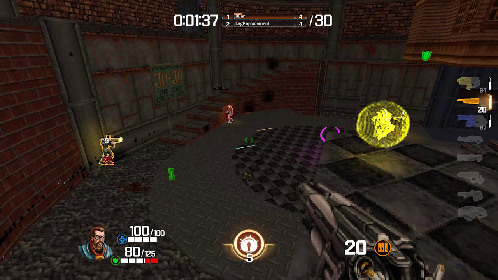

### Quake Champions : Doom Edition Dedicated Server in Docker



From the [offical site](https://qcde.net/): 
“QC: Doom Edition” is a mod that brings the weapons from the latest Quake game, into Doom, with delicious pixelated flavor. More than just weapons, it also brings the “Champions” mechanic -- different player classes, each one with unique status, speed, active and passive abilities. Powered by [Q-Zandronum](https://qzandronum.com/) a modification of the Doom 2 engine that has Quake style movement.

The manual for QCDE can be found at [this link](https://qcde.net/files/public/QCDE_Manual.pdf).

This repository does not contain any WADS made by ID softaware, It uses the [Freedoom wads](https://freedoom.github.io/download.html) that comes with the inslation of QCDE.


This repository is maintained by [Laclede's LAN](https://lacledeslan.com). Its contents are intended to be bare-bones and used as a stock server. For an example of building a customized server from this Docker image browse the related child-project [gamesvr-qcde-freeplay](https://github.com/LacledesLAN/gamesvr-qcde-freeplay). If any documentation is unclear or it has any issues please see [CONTRIBUTING.md](./CONTRIBUTING.md

### Download

```shell
docker pull lacledeslan/gamesvr-gamesvr-qcde;
```


### Run Self Tests

The image includes a test script that can be used to verify its contents. No changes or pull-requests will be accepted to this repository if any tests fail.


### Run simple interactive server  
This command is case sesnsitive on the file names. 

```shell
docker run -it --rm --net=host lacledeslan/gamesvr-qcde ./q-zandronum-server -port 10666 -iwad freedoom2.wad -file QCDEv3.0.pk3 QCDEmaps3.0.pk3 -optfile QCDEmus3.0.pk3 +exec /app/test.cfg;
```
### Selecting game mode
QC:DE has multiple game modes, in order to select the correct game mode you want you just have to change the "+exec /app/server.cfg". With in the main folder there are config files for each mode to chose from. Just look for the files named "server-(gamemode).cfg".

| Gamemode                 | Server Config File       |
|--------------------------|--------------------------|
| Capture the Flag         | server-CTF.cfg           |
| Deathmatch               | server-DM.cfg            |
| Domination               | server-DOM.cfg           |
| Duel                     | server-Duel.cfg          |
| Instagib                 | server-Instagib.cfg      |
| Last Man Standing        | server-LMS.cfg           |
| Team Deathmatch          | server-TDM.cfg           |
| Team Last Man Standing   | server-TLMS.cfg          |


## Getting Started with Game Servers in Docker

[Docker](https://docs.docker.com/) is an open-source project that bundles applications into lightweight, portable, self-sufficient containers. For a crash course on running Dockerized game servers check out [Using Docker for Game Servers](https://github.com/LacledesLAN/README.1ST/blob/master/GameServers/DockerAndGameServers.md). For tips, tricks, and recommended tools for working with Laclede's LAN Dockerized game server repos see the guide for [Working with our Game Server Repos](https://github.com/LacledesLAN/README.1ST/blob/master/GameServers/WorkingWithOurRepos.md). You can also browse all of our other Dockerized game servers: [Laclede's LAN Game Servers Directory](https://github.com/LacledesLAN/README.1ST/tree/master/GameServers).


